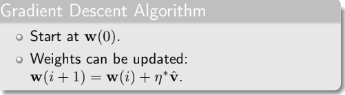
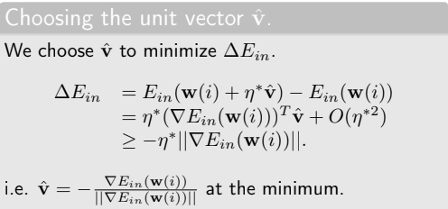

# Data

```{r}
library(MASS)

y<-as.integer(Melanoma$status==1)
x<-Melanoma$thickness
seqs<-1:length(y)
y[seqs[y!=1]]<--1 #we need the y's to be either +1 or -1

plot(x,y,xlab="Melanoma Thickness (mm)",ylab="Died from Melanoma?",main="Survival from Malignant Melanoma",cex=0.5)
xx<-seq(0,max(x),0.1) # Why are these our x values?
yy<-exp(-1.6128243+(0.2088352*xx))/(1+exp(-1.6128243+(0.2088352*xx))) # logistic funcion
plot(xx,yy,ylim=c(0,1),main="Probability of Death from Melanoma",xlab="Melanoma Thickness (mm)",ylab="Probability",type="l",col="blue")
lines(xx,yy,col="blue")
```

# Cross Entropy

$$
E_{\mathrm{in}}(\mathbf{w})
=
\frac{1}{n}
\sum_{i=1}^{n}
\ln\left(1 + e^{-y_i\mathbf{w}^{T}\mathbf{x}_i}\right)
$$

{width="532"}

{width="544"}

```{r}
# Define Loss Function
# Cross Entropy Error


CrossEntropy=function(x,y,w){
  n<-length(y)
  err<-0
  for(i in 1:n){
    err<-err+(log(1+exp(-1*y[i]*(w[1]+(w[2]*x[i]))))/n) # CE definition
  }
  return(err)
}

CrossEntropy(xx,yy,c(0.2,0.45)) # returns single number

```

```{r}

# Store the above in a matrix
# Remember the error is computed at a prediction level and averaged out in the end to get a single value
gridder=function(n,xlim,ylim,xdata,ydata){
  x<-seq(xlim[1],xlim[2],(xlim[2]-xlim[1])/(n-1))
  y<-seq(ylim[1],ylim[2],(ylim[2]-ylim[1])/(n-1))
  z<-matrix(data=NA,ncol=n,nrow=n)
  for(i in 1:n){
    for(j in 1:n){
      z[i,j]<-CrossEntropy(xdata,ydata,c(x[i],y[j]))
    }
  }
  dens<-list(x,y,z)
  class(dens)<-"data.frame"
  names(dens)<-c("x","y","z")
  row.names(dens)<-1:n
  return(dens)
}
```

## Loss Function/Cross Entropy gradients

## $$
\frac{\partial E_{\mathrm{in}}(\mathbf{w})}{\partial w_j}
=
-\frac{1}{n}
\sum_{i=1}^{n}
\frac{y_i x_{ij}}
{1+e^{y_i\mathbf{w}^{T}\mathbf{x}_i}}
$$

## $$
\nabla_{\mathbf{w}} E_{\mathrm{in}}(\mathbf{w})
=
-\frac{1}{n}
\sum_{i=1}^{n}
\frac{y_i\mathbf{x}_i}
{1+e^{y_i\mathbf{w}^{T}\mathbf{x}_i}}
$$

$$
w_{j,\mathrm{new}}
\leftarrow
w_{j,\mathrm{old}}
+
\frac{\eta}{n}
\sum_{i=1}^{n}
\frac{y_i x_{ij}}
{1+e^{y_i\mathbf{w}_{\mathrm{old}}^{T}\mathbf{x}_i}}
$$

**Stopping Criteria**

$$
\left\|
\mathbf{w}_{\mathrm{old}}-\mathbf{w}_{\mathrm{new}}
\right\|_2 < \epsilon
\quad \text{or} \quad
\operatorname{length}(\mathrm{err}) > 10000
$$\
err is stored as a vector

```{r}
a=2
a
```

```{r}

# GD FROM SCRATCH! :()
# CRY WITH ME ARGENTINA!
GradientDescent=function(w0,eta,eps,x,y){
  n<-length(y)
  w=w0
  w.old=w0
  quit=FALSE
  err<-CrossEntropy(x,y,w0)
  while(!quit){
    grad<-c(0,0)
    for(i in 1:n){
      grad[1]<-grad[1]-(1/n)*((y[i]*1)/(1+exp(y[i]*(w.old[1]+(w.old[2]*x[i]))))) # Gradient of the loss function w.r.t w0/ first weight
    
      grad[2]<-grad[2]-(1/n)*((y[i]*x[i])/(1+exp(y[i]*(w.old[1]+(w.old[2]*x[i]))))) # Gradient of the loss function w.r.t w1/ second weight
    }
    w.new<-w.old-(eta*grad) # update step- vectorized here
    w<-rbind(w,w.new)
    
    # Stopping criteria
    # Euclidean distance of weights OR
    # when 1000 err values have been stored - to prevent code from running forever
    
    if((sqrt(((w.old-w.new)[1]^2)+((w.old-w.new)[2]^2))<eps)|length(err)>10000){quit<-TRUE}
    w.old<-tail(w,1)
    err<-c(err,CrossEntropy(x,y,w.new)) # append new computed error
  }
  iterate<-list(err,w)
  names(iterate)<-c("err","w")
  return(iterate)
}

```

### Run the above with actual values

```{r}
# try eta=0.1, 0.5, 0.9
iter<-GradientDescent(c(0,0),0.9,0.0000001,x,y)
plot(1:200,iter$err[1:200],type="l",xlab="No of iterations",ylab="Error",main=expression("Cross Entropy Error ("~eta~"=0.9)"))
plot(1:length(iter$err),iter$err,type="l",xlab="No of iterations",ylab="Error",main=expression("Cross Entropy Error ("~eta~"=0.5)"))

xlim<-c(-6,2.)
ylim<-c(-0.4,1.0)
d<-gridder(100,xlim,ylim,x,y)
persp(d, phi = 45, theta = 30, shade = .1, border = NA)

image(d,xlab=expression(w[0]),ylab=expression(w[1]),main=expression("Cross Entropy Error ("~eta~"=0.5, steps=327)")); contour(d, add = T)
points(iter$w[,1],iter$w[,2],col="blue",pch=19,lwd=1.2,type="o",cex=0.3)
iter$w[dim(iter$w)[1],]
```

## Stochastic Gradient Descent

```{r}

#note num should be divisble by avgNum
#the last avgNum observations are used to estimate the average Cross Entropy Error
StochasticGradientDescent=function(w0,eta,x,y,num,avgNum){
  n<-length(y)
  inds<-1:n
  w<-matrix(NA,nrow=(num+1),ncol=2)
  w[1,]=w0
  err<-CrossEntropy(x,y,w0)
  k<-1;avg.err<-c()
  for(i in 1:(num/avgNum)){
    for(j in 1:avgNum){
      k<-k+1
      ind<-sample(inds,1)
      grad<-c(0,0)
      grad[1]<-(-1*((y[ind]*1)/(1+exp(y[ind]*(w[(k-1),1]+(w[(k-1),2]*x[ind])))))) # againt gradient or CE w.r.t w0
      grad[2]<-(-1*((y[ind]*x[ind])/(1+exp(y[ind]*(w[(k-1),1]+(w[(k-1),2]*x[ind])))))) # againt gradient or CE w.r.t w1
      w[k,]<-w[(k-1),]-(eta*grad) # update- here we are updating the every row but the last row in the w matrix- basically we are storring our updated weights
      
      err<-c(err,CrossEntropy(x,y,w[k,])) # Store CE errors
    }
    avg.err<-c(avg.err,mean(err[(k-avgNum+1):(k)]))
  }
  inds<-1:(num/avgNum)
  plot(inds,avg.err,type="l",xlab="time index",ylab="Average Error",main=expression("Average Error over last 1000 iterations ("~eta~"=0.1)"))
  return(w)
}

xlim<-c(-6,2.)
ylim<-c(-0.4,1.0)
d<-gridder(100,xlim,ylim,x,y)

```

### Plot the above

```{r}
w<-StochasticGradientDescent(c(-6,-0.3),0.1,x,y,100000,1000)
w[dim(w)[1],] #final parameter estimate
image(d,xlab=expression(w[0]),ylab=expression(w[1]),main=expression("Cross Entropy Error ("~eta~"=0.001)")); contour(d, add = T)
points(w[,1],w[,2],col="blue",pch=19,lwd=1.2,type="o",cex=0.3)
```
